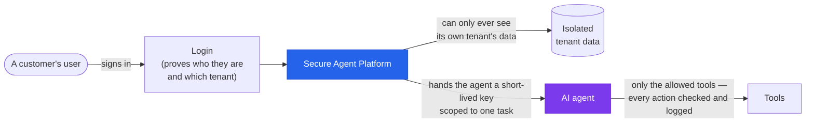
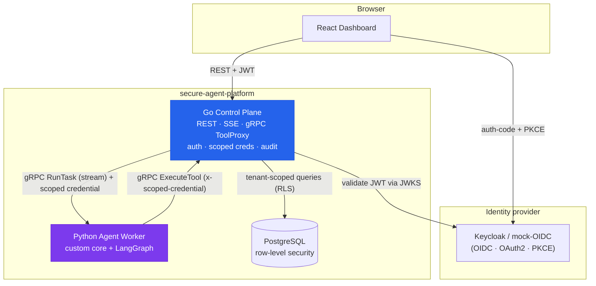
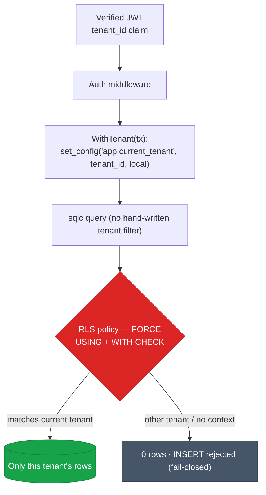
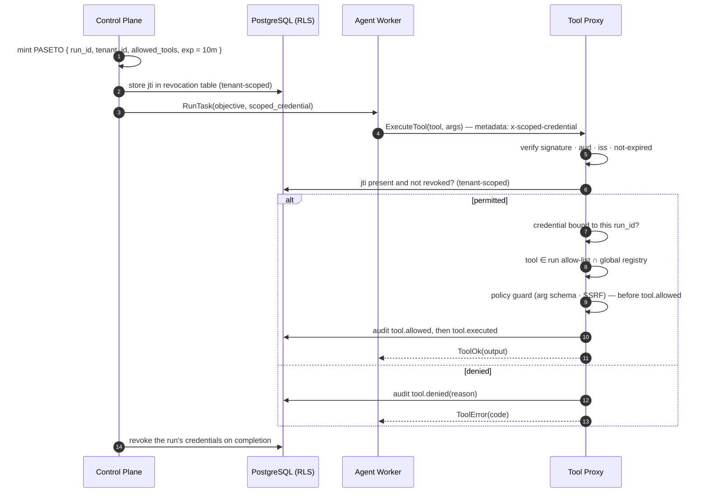

<h1 align="center">secure-agent-platform</h1>

<p align="center"> <b>A multi-tenant backend for running AI agents — securely.</b><br> Go control plane · PostgreSQL row-level-security tenant isolation · short-lived scoped credentials · prompt-injection hardening · a Python agent worker · a React dashboard. </p>

<p align="center"> <a href="https://github.com/jjsanda/secure-agent-platform/actions/workflows/ci.yml"></a> <a href="https://github.com/jjsanda/secure-agent-platform/actions/workflows/security.yml"></a> <a href="https://github.com/jjsanda/secure-agent-platform/actions/workflows/codeql.yml"></a>    </p>

---

## What is this? (in one picture)

> A company can give many customers ("tenants") their own AI agents. This platform makes sure one customer's agent **can never see or touch another customer's data**, that every agent only gets a **short-lived key scoped to exactly the tools it needs for one task**, and that **nothing an agent is tricked into doing** (prompt injection) can escape those limits. Every action is logged.



## Why it's built this way

| Concern | Approach |
|---|---|
| **Multi-tenant isolation** | PostgreSQL **row-level security** (`FORCE`, `USING` + `WITH CHECK`), a non-privileged `NOBYPASSRLS` app role, and a single per-request `WithTenant` transaction. Defense in depth, **proven by tests** that show tenant A cannot read, insert-for, or update tenant B. |
| **Scoped credentials** | On run start the control plane mints a **PASETO** capability token scoped to `{run_id, tenant_id, allowed_tools, exp≈10m}`. The worker holds *only* that opaque token — no DB access, no long-lived secrets. |
| **Tool safety** | Every tool call is re-validated by a **tool proxy** (signature, expiry, revocation, run/tenant binding, allow-list, then policy guard) *before* it runs, then audited. |
| **AI security** | An allow-listed tool surface, a curated **prompt-injection corpus**, and policy guards (argument schema + SSRF) enforced server-side before any side effect. Limitations documented honestly. |
| **Auth** | OIDC/OAuth2 authorization-code + PKCE, JWKS-validated JWTs, refresh rotation, session lifecycle. Provider-agnostic: **Keycloak** or a bundled mock, switched by one env var. |
| **Observability** | OpenTelemetry traces + metrics across both services (one trace per run), OTLP-exportable to any backend. |
| **Runs anywhere** | `docker compose up` works with **zero API keys** — a deterministic mock LLM and a local OIDC provider. |

## Architecture



The dashboard speaks **REST**; the control plane and worker speak **gRPC** internally (run dispatch as a server stream, tool calls as unary). Run events are relayed to the browser over **Server-Sent Events**. More diagrams (auth flow, scoped-credential lifecycle, ER model, run lifecycle) live in [`docs/diagrams/`](docs/diagrams).

## Quickstart

```bash
cp .env.example .env
make up      # default profile: postgres + control-plane + mock-oidc + agent-worker + frontend
make demo    # log in as two tenants, run an agent, print the trace + audit log, prove isolation
make test    # unit + integration tests, incl. the tenant-isolation & injection suites
```

Then open the dashboard at **<http://localhost:5173>** and sign in as **Alice** (Tenant A) or **Bob** (Tenant B) — logging in as each shows that neither can see the other's data.

`make demo` output (abridged) — the whole security loop in one run:

```
== Alice starts an agent run ==
  [status        ] planning
  [plan          ] [ "Understand the objective…", "Call the 'echo' tool…", "Summarize…" ]
  [tool_requested] echo {"input": "…"}
  [tool_result   ] ok · sha256=a99e0825…
  [final         ] Objective addressed via the 'echo' tool…
== Audit log ==
  auth.login → run.created → credential.minted → tool.allowed → tool.executed → run.finished
== Tenant isolation: Bob tries to read Alice's run ==
  Bob GET /runs/… -> 404 Not Found  ✅ isolation holds
```

### Profiles

| Command | Adds | Notes |
|---|---|---|
| `make up` | — | Default. Mock LLM + mock-OIDC. Smallest footprint. |
| `docker compose --profile keycloak up` | real Keycloak IdP | Same login flow; the control plane just changes `OIDC_ISSUER_URL`. |
| `docker compose --profile observability up` | OTel Collector + Jaeger + Prometheus + Grafana | One distributed trace per run. |

> The host used to build this has ~2 GB RAM, so the default profile is deliberately tiny and the heavy profiles are opt-in. Don't run `keycloak` and `observability` together on a small machine.

## Security model (the interesting part)

### Tenant isolation — defense in depth



Three independent layers must all agree before one tenant sees a row: the **JWT `tenant_id` claim**, the **per-request `WithTenant` transaction** that sets a Postgres session variable, and the **`FORCE ROW LEVEL SECURITY` policy** that filters on it. The runtime DB role is non-superuser, non-owner, and `NOBYPASSRLS`, so the policy applies to it unconditionally. Application queries never write a `tenant_id` filter by hand — the database supplies it, so it can't be forgotten. An architecture test fails the build if any code touches the pool outside `WithTenant`.

### Scoped credentials + the tool proxy



The credential is a **PASETO v4.public** (Ed25519) token — asymmetric on purpose, so there's no in-band algorithm to confuse (the JWT `alg:none` class of bugs is impossible) and the signing key is cleanly separable from verification. The worker never holds anything but the opaque token.

Full trust boundaries and **honest limitations** are in [`docs/security-model.md`](docs/security-model.md) and [`docs/threat-model.md`](docs/threat-model.md). Short version: this is *defense in depth* (least privilege + an allow-listed, guarded tool surface + a complete audit trail), **not** a claim of being "prompt-injection-proof" — which heuristics alone cannot deliver.

## Testing

The security claims are backed by tests, not assertions in prose:

- **Tenant isolation** (`control-plane/test`, testcontainers + real Postgres): tenant A cannot read, insert-for, or update tenant B; no tenant context denies everything; the app role has no RLS bypass.
- **Scoped credentials** (`internal/credential`): mint/verify round-trip, expiry, not-yet-valid, wrong key, and tamper are all rejected.
- **OIDC** (`cmd/mock-oidc`): the mock IdP's tokens are verified with the real `go-oidc` library.
- **Agent worker** (`agent-worker/tests`): the plan→act→observe loop, tool-proxy client, and the prompt-injection corpus.

```bash
make test                                   # unit + integration
cd control-plane && go test -tags=integration ./test/...   # the isolation proof
cd agent-worker && uv run pytest -m injection              # the injection corpus
```

## Project layout

```
proto/            gRPC contract (buf) — the source of truth
control-plane/    Go: REST + gRPC, auth, RLS tenancy, scoped-credential tool proxy, audit, mock IdP
agent-worker/     Python: custom + LangGraph agent, security guard, LLM (mock / Claude)
frontend/         React dashboard (Vite + TS + shadcn/ui)
deploy/           docker-compose · Keycloak realm · Helm · kustomize · Terraform · observability
docs/             ADRs · security & threat models · diagrams
```

## Tech stack & why

- **Go** control plane — `chi`, `pgx`/`sqlc` (type-safe SQL, no ORM magic hiding the RLS story), `golang-migrate`, `coreos/go-oidc`, `aidanwoods.dev/go-paseto`, gRPC.
- **Python** worker — `uv` + `hatchling`, `grpcio`, `pydantic`; a custom agent core and a LangGraph variant sharing one guard, tool-proxy client, and LLM port (deterministic mock by default, Claude optional).
- **PostgreSQL** with row-level security as the isolation primitive.
- **React** + Vite + TypeScript + Tailwind + shadcn/ui + TanStack Query.
- **OpenTelemetry**, **Helm**/kustomize, **Terraform** for the ops story.

## Documentation

- [`docs/security-model.md`](docs/security-model.md) — trust boundaries and **honest limitations**.
- [`docs/threat-model.md`](docs/threat-model.md) — threats, mitigations, residual risk.
- [`docs/adr/`](docs/adr) — architecture decision records (why PASETO, why RLS, why local-apply Terraform…).
- [`docs/diagrams/`](docs/diagrams) — all diagrams (Mermaid source + rendered SVG/PNG).

## Roadmap

Ideas that would extend the platform: per-call single-use credentials, an LLM-based injection classifier alongside the heuristics, horizontal scale for the SSE fan-out (Postgres `LISTEN/NOTIFY`), and a policy-as-code layer for tool arguments.

## License

[Apache 2.0](LICENSE) © 2026 Josef Šanda · see [SECURITY.md](SECURITY.md) to report an issue.
